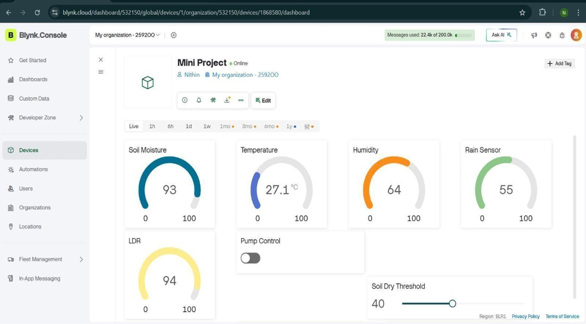
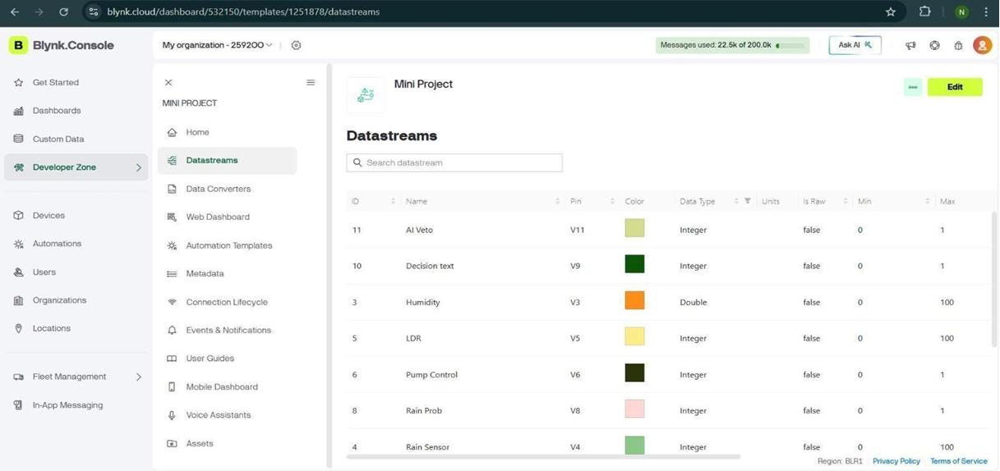
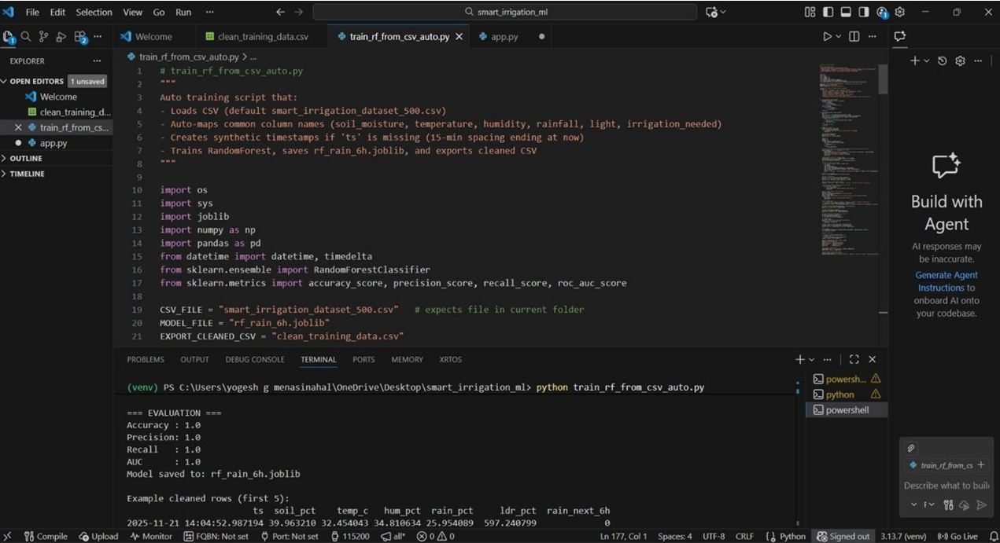
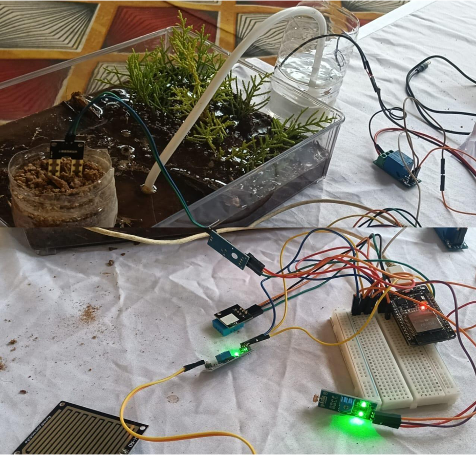
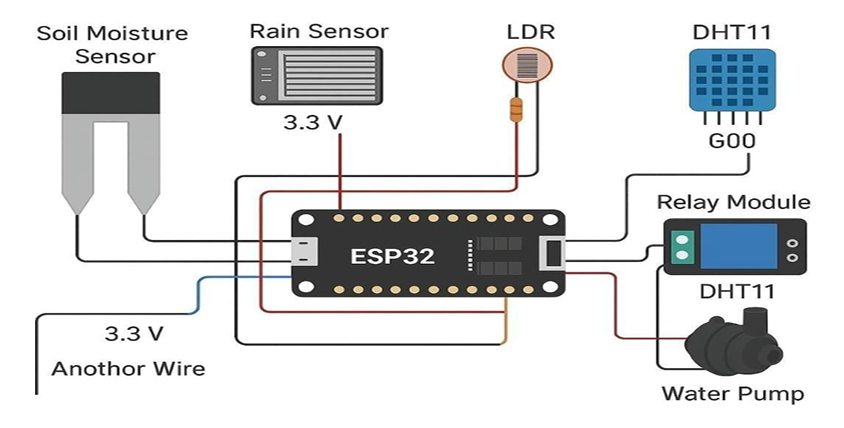
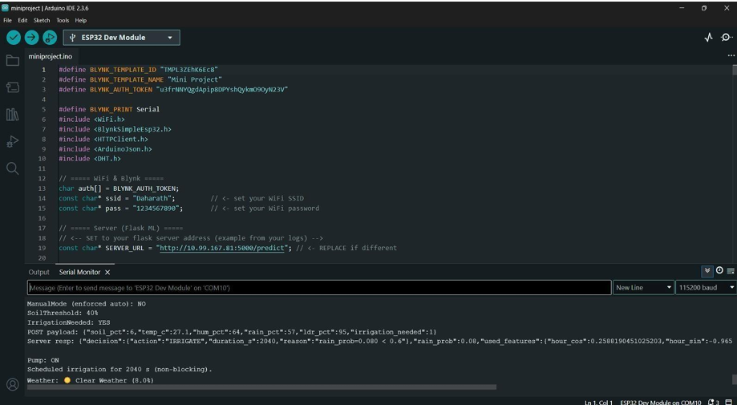

# 🌱 Smart Irrigation System Using Weather Forecasting

## 📌 Overview

The **Smart Irrigation System Using Weather Forecasting** is an AI and IoT-based solution designed to optimize water usage in agriculture.
It uses real-time sensor data and machine learning-based weather prediction to automate irrigation and improve crop productivity.

---

## 🚜 Problem Statement

Traditional irrigation methods often lead to:

* Overwatering or underwatering crops
* Water wastage
* Increased manual effort

This system solves these issues using **data-driven decision-making**.

---

## 🎯 Objectives

* Automate irrigation using AI and IoT
* Reduce water wastage
* Improve crop yield
* Enable real-time monitoring
* Support smart farming practices

---

## ⚙️ System Architecture

### 🔄 Workflow

1. Sensors collect environmental data
2. Data is sent to ESP32 microcontroller
3. Machine Learning model predicts irrigation needs
4. Pump is controlled automatically
5. Farmer monitors via mobile app

---

## 🧠 Methodology

* Collect data from sensors:

  * Soil Moisture
  * Temperature
  * Humidity
  * Rainfall
* Train ML model (**Random Forest**)
* Predict irrigation requirements
* Automatically control water pump
* Send alerts for abnormal conditions

---

## 🛠️ Technologies Used

### 💻 Software

* Python
* Flask
* scikit-learn
* pandas
* matplotlib

### 🔌 Hardware

* ESP32
* Soil Moisture Sensor
* DHT11 (Temperature & Humidity Sensor)
* Rain Sensor
* Flow Sensor
* Water Pump & Solenoid Valve

### 📱 Mobile App

* Blynk

---

## ✨ Features

* ✅ AI-based irrigation prediction
* ✅ Weather forecasting integration
* ✅ Automatic water control
* ✅ Real-time monitoring
* ✅ Mobile app control
* ✅ Offline capability

---

## 🚀 How to Run

### 1️⃣ Install dependencies

```bash
pip install flask scikit-learn pandas matplotlib joblib
```

### 2️⃣ Train the model

```bash
python train_model.py
```

### 3️⃣ Run Flask server

```bash
python flask_server.py
```

---

## 📡 API Endpoint

### 🔹 Predict Irrigation

```
POST /predict
```

### Example Input

```json
{
  "temperature": 30,
  "humidity": 70,
  "soil_moisture": 40
}
```

### Example Output

```json
{
  "irrigation": "ON"
}
```

---

## 📸 Project Screenshots

### 📱 Blynk App Readings



### 📊 Blynk Templates



### 🌐 Flask Server Page



### ⚙️ Hardware Setup



### 🔌 Circuit Diagram



### 💻 Arduino Code



---

## 📊 Results

* Automated irrigation system implemented
* Reduced water consumption
* Real-time monitoring enabled
* Improved farming efficiency

---

## ⚠️ Limitations

* Initial setup cost
* Sensor maintenance required
* Limited dataset accuracy
* Internet dependency in some areas

---

## 🔮 Future Scope

* Integration with deep learning models
* Solar-powered irrigation system
* Advanced weather forecasting
* Smart alert system
* Multi-crop support

---

## 📌 Note

⚠️ The trained model file is not included due to GitHub size limits.
You can regenerate it using:

```
python train_model.py
```

---

## 👨‍💻 Team

* Archana A
* Bhagya Hugar
* Nidish M
* Nithin T

---

## 🏫 Institution

Bapuji Institute of Engineering and Technology
Visvesvaraya Technological University, Belagavi

---

## 🌍 Conclusion

This project demonstrates how **AI + IoT** can transform agriculture by:

* Saving water
* Reducing manual effort
* Improving crop yield

It promotes **sustainable and smart farming practices**.
